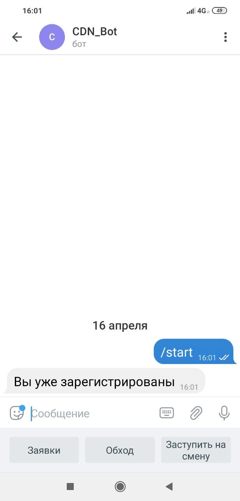

# TelegramBotForDispatchers

<h1>Разработка TelegramBot для автоматизации диспетчеризации и обслуживания клиентов.</h1>

<H2>Виды проводимых работ</H2>
1.	Проектирование базы данных и структуры кода.
2.	Создание базы данных и разработка приложения.

 
<H3>1.	Проектирование и разработка базы данных</H3>
База данных состоит 5 основных таблиц.

1.	Users;

2.	Note;

3.	AllEvents;

4.	ChangeOfDuty;

5.	Request_Client.

Таблица Users – содержит в себе информацию о таких пользователях как клиенты и диспетчера. Так же эта таблица играет роль авторизации пользователей, для предотвращения использования телеграм бота не авторизироваными пользователями.

Таблица Note - список заметок диспетчеров, которые они оставляют во время дежурства.

Таблица AllEvents – список всех событий, которые происходят в чате бота.

Таблица ChangeOfDuty – содержит в себе информацию о смене дежурств диспетчеров. 

Таблица Request_Client – сохраняет все заявки клиентов.

<H3>Диаграмма структуры базы данных:  </H3>

<H2>2.	Проектирование и разработка приложения</H2>

Приложение телеграм бота реализует в себе функции для 2 типов пользователей. 

1.	Диспетчер

2.	Клиент ЦОД

Для диспетчера реализован функционал записи данных об осмотрах, записи заметок по ходу дежурства, обслуживание заявок клиентов ЦОД и создание отчетов.
Клиенты могут воспользоваться функцией создания заявок на обслуживание своего оборудования, или же узнать какую-то важную информацию.

<H3>Скриншоты интерфейса телеграм бота для клиента:  </H3>

         
Рисунок 1 – Основное меню клиента.

Скриншоты телеграм бота для диспетчеров:  

Рисунок 2 – Основное меню Диспетчера.

 

 
Рисунок 3 – Меню Заявок для Диспетчера.

 

Рисунок 4 – Просмотр активных заявок для Диспетчера.

Рисунок 5 – Меню Обход для Диспетчера.

<H2>Описание работы программы.</H2>

После нажатия кнопки «/start» пользователь попадает в меню регистрации, где после нажатия на кнопку «Регистрация», он вводит свое имя, для того что бы администратор мог его идентифицировать.
Отправляя сообщение с именем, в таблице «Users» появляется новая запись с id чата и именем, которое ввел пользователь. Администратор добавляет пользователю его Роль в системе, путем ручной вставки в строку пользователя (1 – клиент, 2 – диспетчер).
	Пользователь, который имеет роль в системе, далее может воспользоваться особым меню. Меню пользователя «Клиент» изображено на рисунке 1, а меню пользователя «Диспетчер» на рисунке 2.
Пользователь «Клиент» может создавать заявки, просматривать заявки, которые ожидают рассмотрения и находятся на выполнении, а также просматривать историю заявок. 
Пользователь «Диспетчер» может заступать на смену, сдавать смену, вести заметки по ходу дежурства, проводить обход ЦОД, и рассматривать заявки пользователей.

<H3>Диспетчер</H3>

Рассмотрим функции диспетчера и их работу в приложении. Приходя на смену, диспетчер заступает на смену, о чем создается запись в соответствующей таблице, после чего диспетчер может вести записывать заметки и проводить обход. Заметки записываются в Базу и будут отсылаться начальству (Когда будет разработан модуль отчетности). Информация об обходах так же записываться в базу и несет в себе важную информацию, о том, кто и когда проводил обход. 
Так же, по мимо работы с заметками и обходами, диспетчер может работать с заявками клиентов. Бот, при каждой новой заявке оповещает всех диспетчеров о том, что создана новая заявка, а диспетчер должен перейти в меню «Заявки» и в меню нажать кнопку «Ожидающие заявки», после чего, бот пришлет список заявок, которые ожидают рассмотрения. Для того что бы принять заявку на выполнение, диспетчер должен нажать на кнопку «Выполнить» под текстом заявки, после чего заявка сменит статус и будет ожидать завершения выполнения. После проведения действий, которые требуются в заявке, диспетчер должен зайти в меню «Заявки» и нажать кнопку заявки на выполнении, найти свою заявку и завершить ее, нажав на кнопку под текстом заявки.

<H3>Клиент</H3>

Теперь функции клиента и то как они работают в приложении. Клиент, может создавать заявки, смотреть заявки, которые находятся на выполнении или ожидают, смотреть историю всех своих заявок, а также посмотреть контактные данные работающего в этот момент диспетчера или кого-то из руководителей ЦОД. 
Когда клиент создает заявку, он вписывает текст заявки и отправляет его, в последствии, всем диспетчерам рассылается оповещение о создании новой заявки. Запрашивая список своих активных заявок, клиент получает все свои заявки, которые находятся на рассмотрении или на выполнении, а запрашивая историю заявок, клиенту показывается список всех его заявок.
 
<H3>Блок создания отчетов<H3>

Отчет создается автоматически после завершения смены диспетчером или по запросу через меню «Отчеты» в Телеграм боте. По запросу можно выбрать отчет за определенную дату (для этого нужно ввести дату формата – дд.мм.гггг) и отчет за месяц. Отчет состоит из пунктов Заявки за период, Обходы за период и заметки, которые написали диспетчера за период
